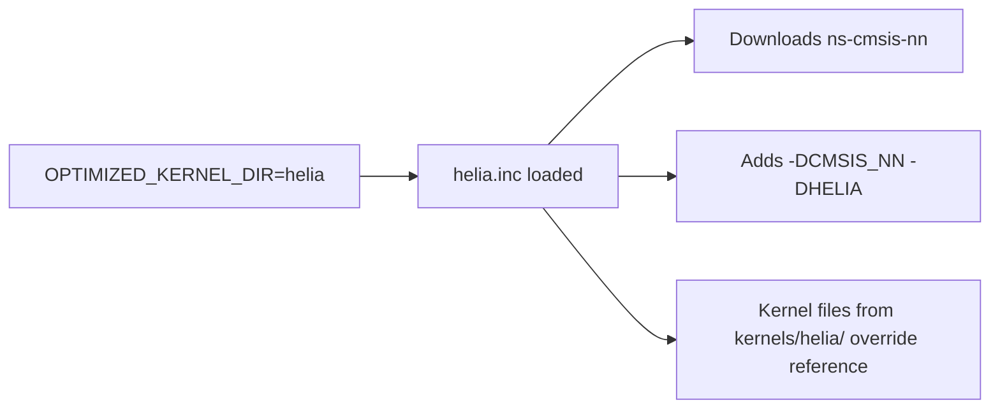

# Architecture

heliaRT is a thin layer on top of upstream [tflite-micro](https://github.com/tensorflow/tflite-micro). This page explains the source layout and how HELIA kernels are wired into the build.

## Source Layout

```
helia-rt/
├── tensorflow/lite/micro/          # Upstream TFLM + Ambiq additions
│   ├── kernels/                    # Reference kernels (upstream)
│   │   ├── cmsis_nn/               # Open-source Arm CMSIS-NN overrides
│   │   └── helia/                  # ★ Ambiq HELIA kernel overrides
│   │       ├── helia_common.h
│   │       ├── conv.cc
│   │       ├── fully_connected.cc
│   │       └── ...                 # 36 optimised kernels
│   ├── tools/make/
│   │   └── ext_libs/
│   │       └── helia.inc           # ★ Makefile backend wiring
│   └── heliart_version.h           # ★ Version macro
├── zephyr/
│   ├── CMakeLists.txt              # ★ Zephyr build integration
│   ├── Kconfig                     # ★ Backend selection menu
│   └── module.yml
├── ci/
│   └── disable_upstream_workflows.sh  # ★ Blast-radius script
├── .github/workflows/
│   ├── helia_release.yml           # ★ Release + artifact bundling
│   └── tests_entry.yml             # ★ CI entry point
└── third_party_static/             # Vendored headers (flatbuffers, etc.)
```

Files marked with ★ are Ambiq additions (not present upstream).

## How Kernels Are Wired

### Makefile builds

The `OPTIMIZED_KERNEL_DIR` variable selects the backend:



For each operator, the build system checks `kernels/<backend>/<op>.cc`. If the file exists, it replaces `kernels/<op>.cc`. Otherwise the Reference kernel is used.

### Zephyr builds

The `helia_rt_select_kernel_source()` CMake function implements the same logic:

```cmake
function(helia_rt_select_kernel_source out_var relative_path)
    if(HELIA_RT_OPTIMIZED_KERNEL_DIR)
        set(candidate "${KERNEL_ROOT}/${HELIA_RT_OPTIMIZED_KERNEL_DIR}/${relative_path}")
        if(EXISTS "${candidate}")
            set(${out_var} "${candidate}" PARENT_SCOPE)
            return()
        endif()
    endif()
    set(${out_var} "${KERNEL_ROOT}/${relative_path}" PARENT_SCOPE)
endfunction()
```

### Backend dependencies

| Backend | External dependency | Managed by |
|---|---|---|
| Reference | None | Built-in |
| CMSIS-NN | `cmsis` + `cmsis-nn` | Makefile: auto-download / Zephyr: west module |
| HELIA | `cmsis` + `ns-cmsis-nn` | Makefile: auto-download / Zephyr: west module |

## Design Principles

1. **Minimal diff from upstream** — Ambiq additions live in dedicated directories (`kernels/helia/`, `ci/`, `zephyr/`). Upstream files are edited only when absolutely necessary.

2. **Preserve the TFLM API** — no public API changes that break upstream compatibility. `MicroInterpreter`, `OpResolver`, and the `.tflite` format are identical.

3. **Backend as extension** — HELIA kernels are additive. They don't fork CMSIS-NN; they provide an independent set of optimised implementations that coexist with CMSIS-NN and Reference.

4. **Upstream workflows are disabled via API** — not by editing YAML files. The `ci/disable_upstream_workflows.sh` script uses the GitHub API to disable upstream workflows, keeping the YAML files unmodified and reducing merge conflicts.

## Adding a New Kernel

1. Create `tensorflow/lite/micro/kernels/helia/<op>.cc`
2. Implement the optimised kernel, following the signature of the Reference version
3. The build system will automatically pick it up — no other wiring needed
4. Add tests (see `kernels/helia/tests/` for examples)
5. Update the [operator coverage matrix](../reference/operator-coverage.md)

## Next Steps

- [Upstream Sync](upstream-sync.md) — how we stay current with tflite-micro
- [Kernel Selection](../guides/kernel-selection.md) — user-facing backend choice guide
