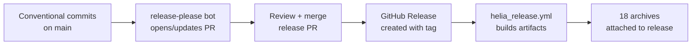

# Release Process

heliaRT uses [release-please](https://github.com/googleapis/release-please) for automated version bumps and changelog generation.

## How It Works



### 1. Conventional Commits

Use prefixes on `main`:

| Prefix | Bump | Example |
|---|---|---|
| `feat:` | Minor | `feat: add int16 hard_swish kernel` |
| `fix:` | Patch | `fix: correct quantize rounding` |
| `feat!:` / `BREAKING CHANGE:` | Major | Breaking API change |
| `chore:` / `docs:` / `ci:` | No bump | Internal changes |

### 2. Release-Please PR

The bot opens a PR that:

- Bumps the version in all managed files
- Updates `CHANGELOG.md` with commit messages
- Stays open and auto-updates as new commits land on `main`

### 3. Version Files

release-please updates these files:

| File | What changes |
|---|---|
| `CHANGELOG.md` | New changelog section |
| `.release-please-manifest.json` | Version number |
| `tensorflow/lite/micro/helia_rt_version.h` | `HELIA_RT_VERSION` macro |

### 4. Artifact Build Matrix

When the release PR merges, `helia_release.yml` builds **18 combinations**:

| Architecture | Toolchain | Build Type |
|---|---|---|
| `cortex-m4+fp` | gcc, armclang, atfe | debug, release, release_with_logs |
| `cortex-m55` | gcc, armclang, atfe | debug, release, release_with_logs |

Each combination produces a `libtensorflow-microlite.a` archive. All 18 are bundled into a single release zip:

```
helia-rt-v1.16.0.zip
├── cortex-m4+fp/
│   ├── gcc/
│   │   ├── debug/
│   │   ├── release/
│   │   └── release_with_logs/
│   ├── armclang/
│   └── atfe/
├── cortex-m55/
│   └── ... (same structure)
└── include/
```

## Cutting a Release

1. Ensure `main` has all desired changes.
2. Review the open release-please PR — check the changelog entries.
3. Merge the release-please PR.
4. Wait for `helia_release.yml` to complete (~30 min).
5. Verify the release artifacts on the [Releases page](https://github.com/AmbiqAI/helia-rt/releases).

## Next Steps

- [Upstream Sync](upstream-sync.md) — how upstream changes flow into releases
- [Architecture](architecture.md) — source layout
