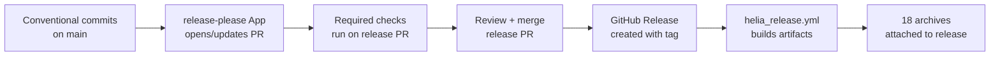

# Release Process

heliaRT uses [release-please](https://github.com/googleapis/release-please) for automated version bumps and changelog generation.

## How It Works


```mermaid
flowchart LR
    A["Conventional commits\non main"] --> B["release-please App\nopens/updates PR"]
    B --> G["Required checks\nrun on release PR"]
    G --> C["Review + merge\nrelease PR"]
    C --> D["GitHub Release\ncreated with tag"]
    D --> E["helia_release.yml\nbuilds artifacts"]
    E --> F["18 archives\nattached to release"]
```

### 1. Conventional Commits

Use prefixes on `main`:

| Prefix | Bump | Example |
|---|---|---|
| `feat:` | Minor | `feat: add int16 hard_swish kernel` |
| `fix:` | Patch | `fix: correct quantize rounding` |
| `feat!:` / `BREAKING CHANGE:` | Major | Breaking API change |
| `chore:` / `docs:` / `ci:` | No bump | Internal changes |

### 2. Release-Please PR

The bot opens a PR that:

- Bumps the version in all managed files
- Updates `CHANGELOG.md` with commit messages
- Stays open and auto-updates as new commits land on `main`

### 3. Version Files

release-please updates these files:

| File | What changes |
|---|---|
| `CHANGELOG.md` | New changelog section |
| `.release-please-manifest.json` | Version number |
| `tensorflow/lite/micro/helia_rt_version.h` | `HELIA_RT_VERSION` macro |

### 4. Artifact Build Matrix

When the release PR merges, `helia_release.yml` builds **18 combinations**:

| Architecture | Toolchain | Build Type |
|---|---|---|
| `cortex-m4+fp` | gcc, armclang, atfe | debug, release, release_with_logs |
| `cortex-m55` | gcc, armclang, atfe | debug, release, release_with_logs |

Each combination produces a `libtensorflow-microlite.a` archive. All 18 are bundled into a single release zip:

```
helia-rt-v1.16.0.zip
├── cortex-m4+fp/
│   ├── gcc/
│   │   ├── debug/
│   │   ├── release/
│   │   └── release_with_logs/
│   ├── armclang/
│   └── atfe/
├── cortex-m55/
│   └── ... (same structure)
└── include/
```

## Cutting a Release

1. Ensure `main` has all desired changes.
2. Review the open release-please PR — check the changelog entries.
3. Merge the release-please PR.
4. Wait for `helia_release.yml` to complete (~30 min).
5. Verify the release artifacts on the [Releases page](https://github.com/AmbiqAI/helia-rt/releases).

## Release Automation Credentials

release-please authenticates as a **GitHub App**, not as the built-in
`GITHUB_TOKEN`.

**Why this matters.** GitHub deliberately does not start new workflow runs for
events raised by the default `GITHUB_TOKEN`. A release PR opened or force-pushed
by that token never fires `pull_request` or `pull_request_target`, so it collects
**zero check runs** — and the `main` branch ruleset requires 11 passing contexts
with no bypass actors. The release PR is then permanently `BLOCKED`: not slow,
not flaky, but structurally unmergeable. A GitHub App installation token is a
distinct actor exempt from that rule, so the release PR is checked exactly like a
human PR and merges through the same gate. Nothing about the gate is weakened.

The token is minted per run by
[`actions/create-github-app-token`](https://github.com/actions/create-github-app-token),
expires after one hour, is scoped to this repository only, and is revoked when
the job ends. There is no long-lived credential and no personal access token
tied to an individual's account.

### One-Time Setup (org admin)

Requires owner rights on the `AmbiqAI` organization. Steps 1–4 are GitHub UI
actions; nothing here can be done from a workflow.

1. **Create the App** at
   `https://github.com/organizations/AmbiqAI/settings/apps/new`:

     - **GitHub App name:** `AmbiqAI Release Please` (commits and PRs will be
       authored by `ambiqai-release-please[bot]`)
     - **Homepage URL:** `https://github.com/AmbiqAI/helia-rt`
     - **Webhook:** untick **Active** — no webhook is used
     - **Where can this GitHub App be installed:** *Only on this account*

2. **Repository permissions** — grant exactly these and leave every other
   permission at *No access*:

     | Permission | Level | Why release-please needs it |
     |---|---|---|
     | Metadata | Read-only | Mandatory; auto-selected by GitHub |
     | Contents | Read and write | Read commit history, force-push the release branch, create the tag and the GitHub Release |
     | Pull requests | Read and write | Open and update the release PR, and apply the `autorelease: pending` / `autorelease: tagged` labels |

     Do **not** grant Workflows, Actions, Administration, Secrets, Members, or
     any Organization permission. release-please only rewrites `CHANGELOG.md`,
     `.release-please-manifest.json`, and the two `extra-files`
     (`tensorflow/lite/micro/helia_rt_version.h`, `nsx/nsx-module.yaml`); it
     never touches `.github/workflows/**`, so `Workflows: write` is unnecessary.

     !!! note "About `Issues: write`"
         The upstream release-please README lists `issues: write` in its
         workflow-permissions snippet. That is only needed to *create*
         repository labels that do not exist yet. Both `autorelease: pending`
         and `autorelease: tagged` already exist here, and the previous
         `GITHUB_TOKEN` — which had no issues scope — cut 24 releases without
         it. Grant it only if one of those labels is ever deleted, and add a
         matching `permission-issues: write` to the mint step at the same time.

3. **Generate a private key** on the App's settings page (*Private keys* →
   *Generate a private key*). A `.pem` file downloads.

4. **Install the App** on `AmbiqAI/helia-rt` **only** (*Install App* → *Only
   select repositories*).

5. **Add two repository secrets** to `AmbiqAI/helia-rt` under *Settings →
   Secrets and variables → Actions → Repository secrets*:

     | Secret name | Value |
     |---|---|
     | `RELEASE_PLEASE_APP_CLIENT_ID` | The App's **Client ID** (`Iv23li…`), shown on the App's *General* page |
     | `RELEASE_PLEASE_APP_PRIVATE_KEY` | The entire contents of the downloaded `.pem`, including the `-----BEGIN…` and `-----END…` lines |

     The Client ID is not itself sensitive; it is stored as a secret rather than
     an Actions variable purely so both values are configured in one place.
     Delete the downloaded `.pem` once it is pasted in.

6. **Verify** from *Actions → release-please → Run workflow* on `main`. A green
   run means the token mints and release-please can reach the repository.

### If the Secrets Are Missing

`release-please.yml` fails on its first step with:

```text
Error: Release automation is not configured. Missing repository secret(s):
RELEASE_PLEASE_APP_CLIENT_ID RELEASE_PLEASE_APP_PRIVATE_KEY.
```

Every push to `main` shows a failed `release-please` run until the secrets
exist, and **no release PR is opened or updated** in the meantime. Builds,
tests, and docs deploys are separate workflows and are unaffected. The check is
deliberately loud: the failure it replaces was silent, and a release pipeline
that quietly stops is far more expensive than a red workflow.

### Rotating the Private Key

Generate a new private key on the App, replace
`RELEASE_PLEASE_APP_PRIVATE_KEY`, then delete the old key from the App. The
Client ID does not change.

## Next Steps

- [Upstream Sync](upstream-sync.md) — how upstream changes flow into releases
- [Architecture](architecture.md) — source layout
