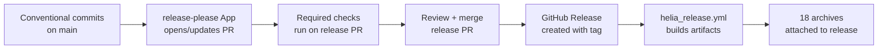

# Release Process

heliaRT uses [release-please](https://github.com/googleapis/release-please) for automated version bumps and changelog generation.

## How It Works


```mermaid
flowchart LR
    A["Conventional commits\non main"] --> B["release-please App\nopens/updates PR"]
    B --> G["Required checks\nrun on release PR"]
    G --> C["Review + merge\nrelease PR"]
    C --> D["GitHub Release\ncreated with tag"]
    D --> E["helia_release.yml\nbuilds artifacts"]
    E --> F["18 archives\nattached to release"]
```

### 1. Conventional Commits

Use prefixes on `main`:

| Prefix | Bump | Example |
|---|---|---|
| `feat:` | Minor | `feat: add int16 hard_swish kernel` |
| `fix:` | Patch | `fix: correct quantize rounding` |
| `feat!:` / `BREAKING CHANGE:` | Major | Breaking API change |
| `chore:` / `docs:` / `ci:` | No bump | Internal changes |

### 2. Release-Please PR

The bot opens a PR that:

- Bumps the version in all managed files
- Updates `CHANGELOG.md` with commit messages
- Stays open and auto-updates as new commits land on `main`

### 3. Version Files

release-please updates these files:

| File | What changes |
|---|---|
| `CHANGELOG.md` | New changelog section |
| `.release-please-manifest.json` | Version number |
| `tensorflow/lite/micro/helia_rt_version.h` | `HELIA_RT_VERSION` macro |

### 4. Artifact Build Matrix

When the release PR merges, `helia_release.yml` builds **18 combinations**:

| Architecture | Toolchain | Build Type |
|---|---|---|
| `cortex-m4+fp` | gcc, armclang, atfe | debug, release, release_with_logs |
| `cortex-m55` | gcc, armclang, atfe | debug, release, release_with_logs |

Each combination produces a `libtensorflow-microlite.a` archive. All 18 are bundled into a single release zip:

```
helia-rt-v1.16.0.zip
├── cortex-m4+fp/
│   ├── gcc/
│   │   ├── debug/
│   │   ├── release/
│   │   └── release_with_logs/
│   ├── armclang/
│   └── atfe/
├── cortex-m55/
│   └── ... (same structure)
└── include/
```

## Cutting a Release

1. Ensure `main` has all desired changes.
2. Review the open release-please PR — check the changelog entries.
3. Merge the release-please PR.
4. Wait for `helia_release.yml` to complete (~30 min).
5. Verify the release artifacts on the [Releases page](https://github.com/AmbiqAI/helia-rt/releases).

## Release Automation Credentials

release-please authenticates as a **GitHub App**, not as the built-in
`GITHUB_TOKEN`.

**Why this matters.** A `pull_request` workflow run whose triggering event was
raised by the default `GITHUB_TOKEN` is created in an approval-required state:
GitHub marks it `conclusion: action_required` and publishes **no check runs at
all** until a maintainer clicks **Approve workflows to run** on the PR.

All 11 required contexts come from `pull_request` workflows — the ten
`helia-test / test-*` from `tests_entry.yml`, and `Validate docs build (strict)`
from `docs.yml` — so a release PR opened by that token reports none of them. The
`main` ruleset requires all 11 and has no bypass actors, so the PR sits at
`BLOCKED`, and every force-push of the release branch resets it. Not slow, not
flaky: unmergeable without a human clicking through, again after every update.

??? example "#177, the worked example"
    PR #177 was opened while `tests_entry.yml` still used `pull_request_target`,
    a trigger the default token does not raise *at all* — so on top of the
    approval gate, the ten test contexts had no run behind them to approve.

    Its two `pull_request` runs were approved by hand on 2026-08-20 and went
    green, `Validate docs build (strict)` included. The PR is still `BLOCKED`.
    Approving bought 1 of the 11 required contexts; the other 10 never existed.

A GitHub App installation token is a distinct actor, exempt from the approval
gate, so the release PR is checked exactly like a human PR and merges through
the same ruleset. Nothing about the gate is weakened.

!!! note "What this costs in CI"
    Once the release PR runs checks, it runs them **per release-branch update**,
    not once per release — the branch edits `nsx/**` and
    `tensorflow/lite/micro/**`, which `smoke_cmake.yml` is path-filtered on.

    Not every push to `main` causes one. `always-update` defaults to false, and
    this repo hides `docs`/`test`/`chore` from the changelog, so a push carrying
    only those regenerates a byte-identical PR body and release-please returns
    without pushing. Since `helia-rt-v1.17.0`: **7 force-pushes across 17 runs**
    in roughly ten weeks.

    `release-please.yml` serialises itself with a repository-wide `concurrency`
    group because two of those seven collided — on 2026-08-19 two overlapping
    runs both force-pushed the branch, twenty seconds apart.

The token release-please authenticates with is minted per run by
[`actions/create-github-app-token`](https://github.com/actions/create-github-app-token):
it expires after one hour, is scoped to this repository alone, carries only the
two permissions above, and is revoked when the job ends.

The **App private key behind it is not short-lived.** GitHub App private keys do
not expire, and anyone holding one can keep minting installation tokens until
that key is deleted on the App — so `RELEASE_PLEASE_APP_PRIVATE_KEY` warrants the
same handling as any other high-value secret. See
[Rotating the private key](#rotating-the-private-key).

What the App buys over a personal access token is blast radius, not lifetime.
The key belongs to the App rather than to a person, so it carries none of that
person's other access and does not follow them out of the org; and its reach is
capped twice over, by the installation (this repository) and by the permission
set (Contents + Pull requests).

### One-Time Setup (org admin)

Requires owner rights on the `AmbiqAI` organization. Steps 1–4 are GitHub UI
actions; nothing here can be done from a workflow.

1. **Create the App** at
   `https://github.com/organizations/AmbiqAI/settings/apps/new`:

     - **GitHub App name:** `AmbiqAI Release Please` (commits and PRs will be
       authored by `ambiqai-release-please[bot]`)
     - **Homepage URL:** `https://github.com/AmbiqAI/helia-rt`
     - **Webhook:** untick **Active** — no webhook is used
     - **Where can this GitHub App be installed:** *Only on this account*

2. **Repository permissions** — grant exactly these and leave every other
   permission at *No access*:

     | Permission | Level | Why release-please needs it |
     |---|---|---|
     | Metadata | Read-only | Mandatory; auto-selected by GitHub |
     | Contents | Read and write | Read commit history, force-push the release branch, create the tag and the GitHub Release |
     | Pull requests | Read and write | Open and update the release PR, comment on it when a release is cut, and apply the `autorelease: pending` / `autorelease: tagged` labels |

     Do **not** grant Workflows, Actions, Administration, Secrets, Members, or
     any Organization permission. release-please only rewrites `CHANGELOG.md`,
     `.release-please-manifest.json`, and the two `extra-files`
     (`tensorflow/lite/micro/helia_rt_version.h`, `nsx/nsx-module.yaml`); it
     never touches `.github/workflows/**`, so `Workflows: write` is unnecessary.

     !!! note "About `Issues: write`"
         The upstream release-please README lists `issues: write` in its
         workflow-permissions snippet, and release-please really does call
         issues-scoped endpoints on every tagged release: it posts the
         "🤖 Created releases" comment on the release PR, removes
         `autorelease: pending`, and adds `autorelease: tagged`.

         It is still not required here. GitHub documents each of those
         endpoints as satisfied by **Issues (write) _or_ Pull requests
         (write)**, and we have direct proof: the previous `GITHUB_TOKEN` ran
         with `contents: write` + `pull-requests: write` and no issues scope at
         all — it has never had one — and on that it cut every release this repo
         has made since adopting release-please, 17 of them, comment and label
         swap included.

         **If that ever turns out to be wrong, the symptom is specific.** The
         comment is posted *after* the tag and GitHub Release are created but
         *before* the label swap, so a `403` there would leave the release and
         tag in place, skip the bundle build (`release_created` never
         surfaces), and leave the merged PR stuck on `autorelease: pending`.
         Every later run then logs `There are untagged, merged release PRs
         outstanding - aborting` and opens no further release PRs — a warning,
         not an error. If you see that, grant **Issues: read and write** and add
         a matching `permission-issues: write` to the mint step in
         `release-please.yml`.

3. **Generate a private key** on the App's settings page (*Private keys* →
   *Generate a private key*). A `.pem` file downloads.

4. **Install the App** on `AmbiqAI/helia-rt` **only** (*Install App* → *Only
   select repositories*).

5. **Add two repository secrets** to `AmbiqAI/helia-rt` under *Settings →
   Secrets and variables → Actions → Repository secrets*:

     | Secret name | Value |
     |---|---|
     | `RELEASE_PLEASE_APP_CLIENT_ID` | The App's **Client ID** (`Iv23li…`), shown on the App's *General* page |
     | `RELEASE_PLEASE_APP_PRIVATE_KEY` | The entire contents of the downloaded `.pem`, including the `-----BEGIN…` and `-----END…` lines |

     The Client ID is not itself sensitive; it is stored as a secret rather than
     an Actions variable purely so both values are configured in one place.
     Delete the downloaded `.pem` once it is pasted in.

6. **Verify** from *Actions → release-please → Run workflow* on `main`. A green
   run means the token mints and release-please can reach the repository.

### If the Secrets Are Missing

`release-please.yml` fails on its first step with:

```text
Error: Release automation is not configured. Missing repository secret(s):
RELEASE_PLEASE_APP_CLIENT_ID RELEASE_PLEASE_APP_PRIVATE_KEY.
```

Every push to `main` shows a failed `release-please` run until the secrets
exist, and **no release PR is opened or updated** in the meantime. It cannot
block any pull request: `release-please` is not one of the 11 required contexts
and runs only on `push` to `main`. Builds, tests, and docs deploys are separate
workflows and are unaffected. The job is guarded on
`github.repository == 'AmbiqAI/helia-rt'`, so forks are not affected at all.

The check is deliberately loud: the failure it replaces was silent, and a
release pipeline that quietly stops is far more expensive than a red workflow.

Note that this only stops the release PR being *opened or updated*. An existing
release PR is untouched, and a maintainer can still populate its
`Validate docs build (strict)` context by clicking **Approve workflows to run**
on the PR — that is one of the 11 contexts, so it does not make the PR
mergeable, but it is worth knowing the button exists.

### Rotating the Private Key

Generate a new private key on the App, replace
`RELEASE_PLEASE_APP_PRIVATE_KEY`, then delete the old key from the App. The
Client ID does not change. Both keys mint valid tokens until the old one is
deleted, so that last step is the one that actually rotates the credential.

Rotate on the usual triggers for a secret that never expires on its own: on a
schedule, whenever someone with access to the `.pem` or to this repository's
Actions secrets leaves, and immediately if the key may have been exposed.
Installation tokens already minted live at most an hour, so deleting the old key
bounds any misuse to that window.

## Next Steps

- [Upstream Sync](upstream-sync.md) — how upstream changes flow into releases
- [Architecture](architecture.md) — source layout
