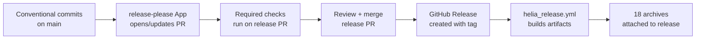

# Release Process

heliaRT uses [release-please](https://github.com/googleapis/release-please) for automated version bumps and changelog generation.

## How It Works


```mermaid
flowchart LR
    A["Conventional commits\non main"] --> B["release-please App\nopens/updates PR"]
    B --> G["Required checks\nrun on release PR"]
    G --> C["Review + merge\nrelease PR"]
    C --> D["GitHub Release\ncreated with tag"]
    D --> E["helia_release.yml\nbuilds artifacts"]
    E --> F["18 archives\nattached to release"]
```

### 1. Conventional Commits

Use prefixes on `main`:

| Prefix | Bump | Example |
|---|---|---|
| `feat:` | Minor | `feat: add int16 hard_swish kernel` |
| `fix:` | Patch | `fix: correct quantize rounding` |
| `feat!:` / `BREAKING CHANGE:` | Major | Breaking API change |
| `chore:` / `docs:` / `ci:` | No bump | Internal changes |

### 2. Release-Please PR

The bot opens a PR that:

- Bumps the version in all managed files
- Updates `CHANGELOG.md` with commit messages
- Stays open and auto-updates as new commits land on `main`

### 3. Version Files

release-please updates these files:

| File | What changes |
|---|---|
| `CHANGELOG.md` | New changelog section |
| `.release-please-manifest.json` | Version number |
| `tensorflow/lite/micro/helia_rt_version.h` | `HELIA_RT_VERSION` macro |

### 4. Artifact Build Matrix

When the release PR merges, `helia_release.yml` builds **18 combinations**:

| Architecture | Toolchain | Build Type |
|---|---|---|
| `cortex-m4+fp` | gcc, armclang, atfe | debug, release, release_with_logs |
| `cortex-m55` | gcc, armclang, atfe | debug, release, release_with_logs |

Each combination produces a `libtensorflow-microlite.a` archive. All 18 are bundled into a single release zip:

```
helia-rt-v1.16.0.zip
├── cortex-m4+fp/
│   ├── gcc/
│   │   ├── debug/
│   │   ├── release/
│   │   └── release_with_logs/
│   ├── armclang/
│   └── atfe/
├── cortex-m55/
│   └── ... (same structure)
└── include/
```

## Cutting a Release

1. Ensure `main` has all desired changes.
2. Review the open release-please PR — check the changelog entries.
3. On that PR, click **Approve workflows to run**. Its checks are parked until
   you do — see [Why the release PR starts with no
   checks](#why-the-release-pr-starts-with-no-checks) for why.
4. Wait for the 11 required checks to go green (~5 min).
5. Merge the release-please PR.
6. Wait for `helia_release.yml` to complete (~30 min).
7. Verify the release artifacts on the [Releases page](https://github.com/AmbiqAI/helia-rt/releases).

## Why the Release PR Starts With No Checks

release-please opens and updates its PR as the built-in `GITHUB_TOKEN`, and
GitHub parks CI for anything a bot set in motion. Concretely: a `pull_request`
run whose triggering event came from `GITHUB_TOKEN` is created as
`conclusion: action_required` and publishes **no check runs** until a maintainer
clicks **Approve workflows to run** on the PR.

All 11 required contexts come from `pull_request` workflows — the ten
`helia-test / test-*` from `tests_entry.yml`, and `Validate docs build (strict)`
from `docs.yml` — so the release PR reports none of them until you click.

**This is the intended flow, not a defect.** Releasing should be a deliberate
act: review the changelog, click, watch the checks pass, merge. Two useful
properties fall out of it:

- **One click per release, not per push.** release-please force-pushes the
  release branch whenever `main` moves and the changelog changes, and that
  resets the checks — but nobody is merging at that moment, so it does not
  matter. You only need green checks when you actually merge.
- **The ten-job matrix stays off intermediate force-pushes.** Between releases
  that is a great deal of CI not spent.

!!! note "Why not a GitHub App?"
    A GitHub App installation token is a *separate actor* and is exempt from the
    gate, so the release PR would be checked with no click at all. That was
    implemented in #199 and then deliberately reverted: it trades a recurring
    click for a private key that never expires, must live in a repository
    secret, and must be rotated.

    Note that granting this workflow **more permissions does not help**. The
    gate keys on *who raised the event*, not on what the token is allowed to do
    — the workflow already runs with `contents: write` + `pull-requests: write`
    under a repository default of `write`.

### If the Checks Never Appear

If you clicked **Approve workflows to run** and the ten `helia-test / test-*`
contexts still never show up, check that `tests_entry.yml` still triggers on
`pull_request`.

It used `pull_request_target` until #198, and that trigger is not merely parked
for a bot — it is never raised *at all*, so there is no run to approve. Release
PR #177 sat blocked for two months on exactly that: approving its runs by hand
produced 1 of the 11 contexts, and the other ten had nothing behind them.

## Next Steps

- [Upstream Sync](upstream-sync.md) — how upstream changes flow into releases
- [Architecture](architecture.md) — source layout
