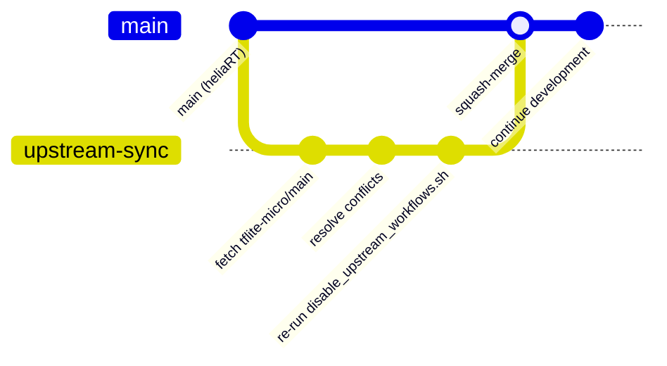

# Upstream Sync

heliaRT is periodically replanted on upstream [tflite-micro](https://github.com/tensorflow/tflite-micro) `main`. This page explains the process and the blast-radius reduction philosophy.

## How It Works



### Step-by-Step

1. **Fetch upstream** — pull the latest `tflite-micro` main into a fresh sync branch.

2. **Resolve conflicts** — because Ambiq additions live in isolated directories (`kernels/helia/`, `ci/`, `zephyr/`), conflicts are typically limited to:
    - `Makefile.inc` (kernel lists)
    - `BUILD` files
    - Shared infrastructure files

3. **Re-disable upstream workflows** — run the idempotent script:

    ```bash
    ./ci/disable_upstream_workflows.sh
    ```

    This uses the GitHub API to disable upstream workflow files that would otherwise run on push. The YAML files remain unedited.

4. **Run CI** — verify the full test matrix passes.

5. **Squash-merge** — merge into `main` with a single `feat: upstream sync` commit.

## Blast-Radius Philosophy

The goal is to minimise the surface area where heliaRT touches upstream code:

| Strategy | Why |
|---|---|
| Ambiq kernels in `kernels/helia/` | Doesn't edit any upstream kernel files |
| `helia.inc` as an ext_lib | Uses the existing `OPTIMIZED_KERNEL_DIR` extension point |
| Upstream workflows disabled via API | Avoids editing upstream YAML files |
| Dependabot ignores for upstream actions | Prevents noise from action version bumps we don't control |
| `third_party_static/` for vendored headers | Avoids submodule conflicts |

!!! success "The result"
    Most upstream syncs resolve with zero or near-zero conflicts because Ambiq additions don't overlap with upstream changes.

## Post-Sync Checklist

- [ ] Run `./ci/disable_upstream_workflows.sh` to re-disable any new upstream workflows
- [ ] Verify [operator coverage matrix](../reference/operator-coverage.md) is still accurate
- [ ] Run full CI matrix
- [ ] Check that Zephyr `CMakeLists.txt` kernel list matches any new/removed upstream kernels
- [ ] Update `CHANGELOG.md` with the sync details

## Next Steps

- [Architecture](architecture.md) — source layout details
- [Release Process](release-process.md) — how syncs get released
