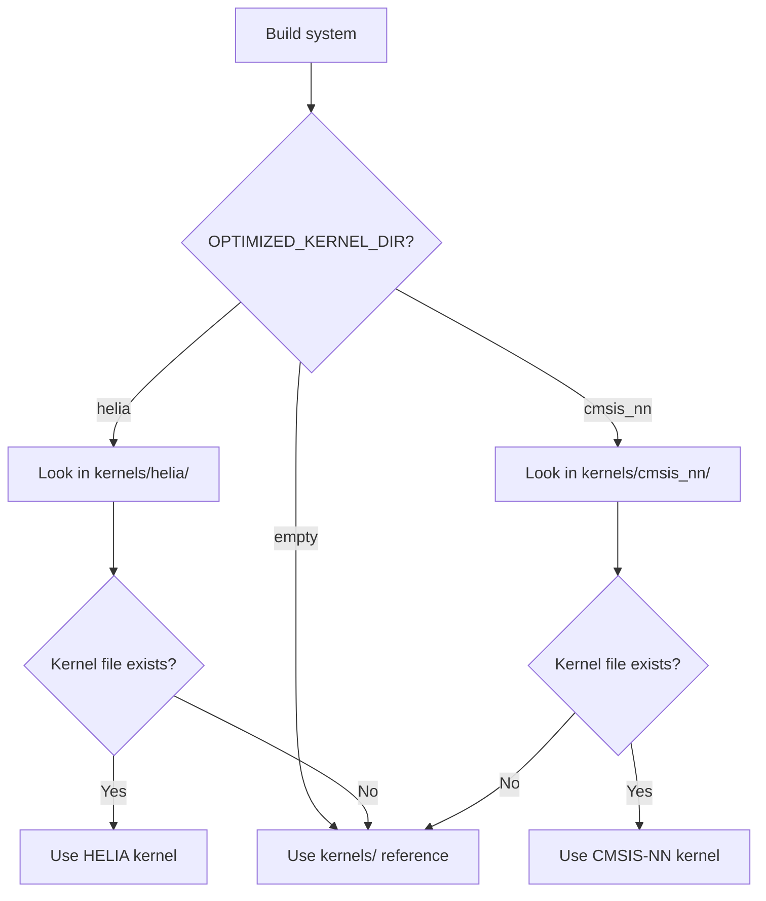

# Kernel Selection

heliaRT supports three kernel backends. The backend is chosen **at build time** — not at runtime.

## Backends

| Backend | Kconfig | `OPTIMIZED_KERNEL_DIR` | Requires |
|---|---|---|---|
| **Reference** | `HELIA_RT_BACKEND_REFERENCE` | _(empty)_ | Nothing extra |
| **CMSIS-NN** | `HELIA_RT_BACKEND_CMSIS_NN` | `cmsis_nn` | Arm CMSIS-NN module |
| **HELIA** | `HELIA_RT_BACKEND_HELIA` | `helia` | Ambiq ns-cmsis-nn module |

## How It Works



For each operator, the build system checks whether an optimized implementation exists in the selected backend directory. If it does, that implementation is compiled instead of the Reference one. If not, the Reference kernel is used automatically.

## Selecting a Backend

=== "Zephyr (Kconfig)"

    ```cfg
    # prj.conf
    CONFIG_HELIA_RT=y
    CONFIG_HELIA_RT_BACKEND_HELIA=y
    ```

    The Kconfig default depends on what modules are available:

    - If `NS_CMSIS_NN` module is present → defaults to **HELIA**
    - If only `CMSIS_NN` module is present → defaults to **CMSIS-NN**
    - Otherwise → defaults to **Reference**

=== "Makefile"

    ```bash
    make -f tensorflow/lite/micro/tools/make/Makefile \
        OPTIMIZED_KERNEL_DIR=helia \
        ...
    ```

## HELIA Kernel Coverage

The HELIA backend currently provides optimized implementations for **36 operators** — expanding to **230+ kernel variants** when counting per-dtype paths (int8 / int16 / float):

??? info "Full list"
    `activations` · `add` · `batch_matmul` · `comparisons` · `concatenation` · `conv` · `depthwise_conv` · `dequantize` · `fill` · `fully_connected` · `hard_swish` · `leaky_relu` · `logistic` · `maximum_minimum` · `mul` · `pack` · `pad` · `pooling` · `quantize_common` · `reduce` · `reshape` · `softmax` · `split` · `split_v` · `squeeze` · `strided_slice` · `sub` · `svdf` · `tanh` · `transpose` · `transpose_conv` · `unidirectional_sequence_lstm` · `zeros_like`

[:octicons-arrow-right-24: Full operator coverage matrix](../reference/operator-coverage.md)

## Per-Kernel Optimization Knobs

The HELIA backend supports per-kernel SPEED/SIZE overrides:

```makefile
CONV_OPT=SPEED    # optimize Conv2D for latency
FC_OPT=SIZE       # optimize FullyConnected for code size
```

These default to `GLOBAL_KERNEL_OPTIMIZE` when not set.

## Next Steps

- [Operator Coverage](../reference/operator-coverage.md) — the complete REF / CMSIS-NN / HELIA matrix
- [SPEED vs SIZE](speed-vs-size.md) — build variant details
- [Toolchains](toolchains.md) — toolchain selection
