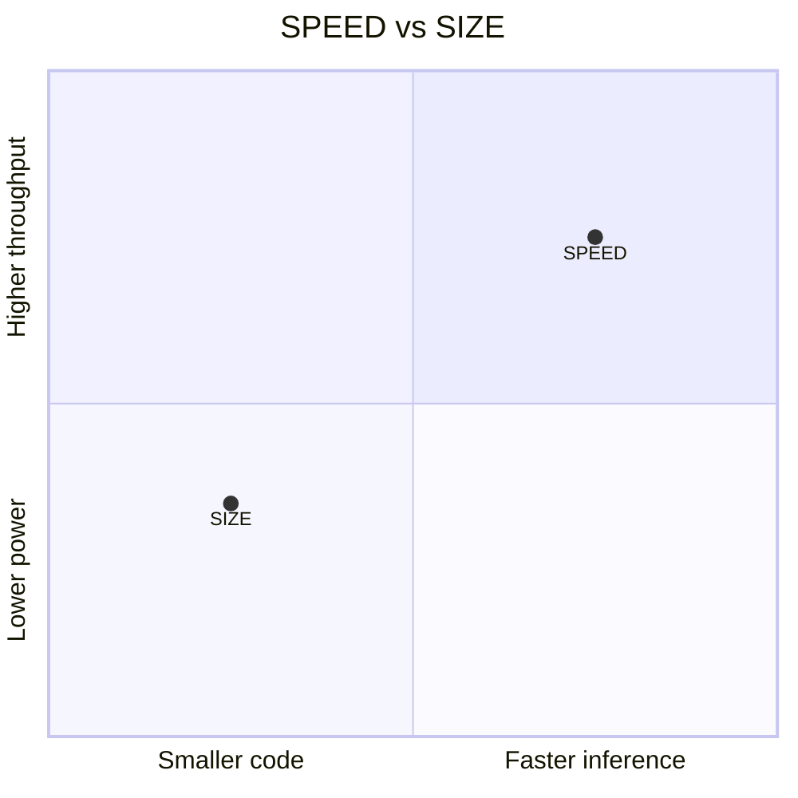

# SPEED vs SIZE Build Variants

Every heliaRT release publishes two optimization profiles. Pick the one that matches your workload's constraints.

## The Two Variants

| Variant | Compiler flags | Optimizes for |
|---|---|---|
| **SPEED** (`release`) | `-O2` / `-Ofast` | Minimum inference latency |
| **SIZE** (`release_with_logs` / custom `-Os`) | `-Os` / `-Oz` | Smallest Flash footprint |

!!! tip "Debug builds"
    A third build type — `debug` (`-O0 -g`) — is also published for development. Never ship it in production.

## Trade-Offs



| Metric | SPEED | SIZE |
|---|---|---|
| Inference latency | ▼ Lower | ▲ Higher |
| Flash usage | ▲ Larger | ▼ Smaller |
| RAM usage | ~Same | ~Same |
| Best for | Real-time audio, always-on wake-word | Battery-first, Flash-constrained |

## How to Select

=== "Prebuilt archive"

    Download the variant you need from the [release bundle](https://github.com/AmbiqAI/helia-rt/releases):

    ```
    helia-rt-<tag>/cortex-m55/atfe/release/          ← SPEED
    helia-rt-<tag>/cortex-m55/atfe/release_with_logs/ ← SIZE + logging
    ```

=== "Source / Makefile"

    ```bash
    # SPEED
    make ... BUILD_TYPE=release microlite

    # SIZE
    make ... BUILD_TYPE=release_with_logs microlite
    ```

=== "Zephyr"

    Standard Zephyr optimization flags apply:

    ```cfg
    # prj.conf
    CONFIG_SPEED_OPTIMIZATIONS=y    # SPEED
    # or
    CONFIG_SIZE_OPTIMIZATIONS=y     # SIZE
    ```

## Kernel-Level Knobs

The HELIA backend exposes per-kernel optimization overrides:

```makefile
# Override individual kernels (values: SPEED or SIZE)
CONV_OPT=SPEED
FC_OPT=SIZE
```

This lets you optimize latency-critical operators (Conv2D) for SPEED while keeping less critical ones optimized for SIZE.

## Next Steps

- [Static vs Source](static-vs-source.md) — distribution format details
- [Toolchains](toolchains.md) — toolchain choice also affects code size and speed
