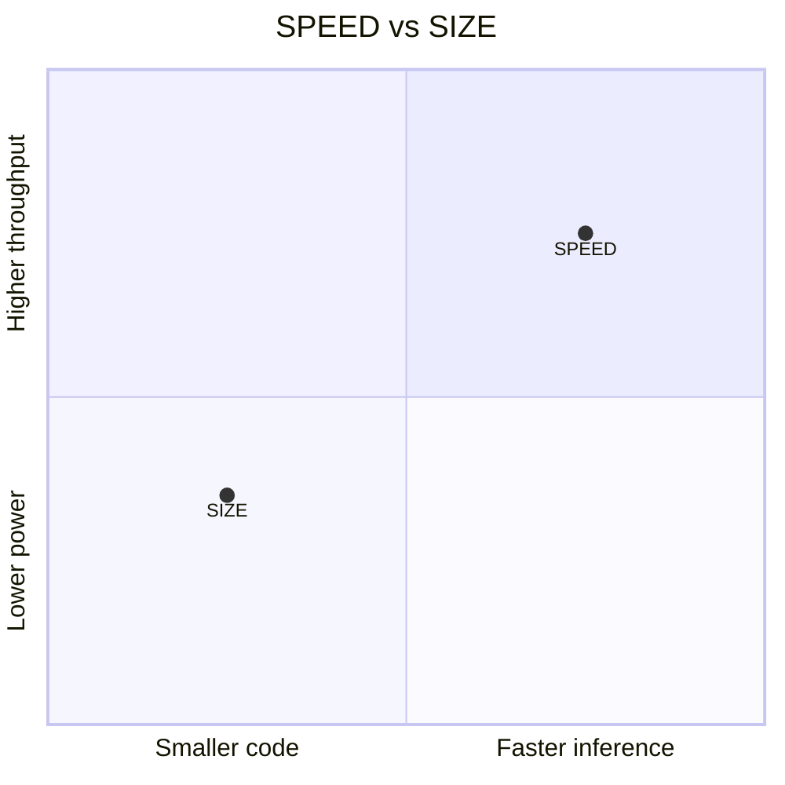

# HELIA Kernel SPEED vs SIZE

The HELIA backend has a build-time kernel profile that selects between
latency-oriented and footprint-oriented implementations for selected kernels.
This is separate from the overall build flavor (`debug`, `release_with_logs`,
or `release`) and separate from compiler flags such as `-O2` or `-Os`.

## The Two Profiles

| Profile | Optimizes for | Effect |
|---|---|---|
| **SPEED** | Minimum inference latency | Enables speed paths in HELIA kernels |
| **SIZE** | Smaller HELIA kernel code paths | Trades runtime for footprint where the kernel offers both paths |

The default is **SPEED**, matching the historical Makefile/prebuilt behavior.

## Trade-Offs



| Metric | SPEED | SIZE |
|---|---|---|
| Inference latency | ▼ Lower | ▲ Higher |
| Flash usage | ▲ Larger | ▼ Smaller |
| RAM usage | Kernel-dependent | Kernel-dependent |
| Best for | Real-time audio, always-on wake-word | Battery-first, Flash-constrained |

## How to Select

=== "Source / CMake"

    ```bash
    cmake -S . -B build \
      -DHELIA_RT_ENABLE_HELIA=ON \
      -DHELIA_RT_GLOBAL_KERNEL_OPTIMIZE=SPEED
    ```

    `HELIA_RT_GLOBAL_KERNEL_OPTIMIZE` accepts `SPEED` or `SIZE`.

    Advanced source builds can override specific HELIA kernel families:

    ```bash
    cmake -S . -B build \
      -DHELIA_RT_ENABLE_HELIA=ON \
      -DHELIA_RT_GLOBAL_KERNEL_OPTIMIZE=SIZE \
      -DHELIA_RT_CONV_OPT=SPEED \
      -DHELIA_RT_FC_OPT=SIZE
    ```

=== "Source / Makefile"

    ```bash
    # SPEED
    make ... OPTIMIZED_KERNEL_DIR=helia GLOBAL_KERNEL_OPTIMIZE=SPEED microlite

    # SIZE
    make ... OPTIMIZED_KERNEL_DIR=helia GLOBAL_KERNEL_OPTIMIZE=SIZE microlite
    ```

    Per-family overrides are available through `CONV_OPT` and `FC_OPT`.

=== "Zephyr Source Module"

    Select the HELIA backend, then choose the kernel profile:

    ```cfg
    CONFIG_HELIA_RT=y
    CONFIG_HELIA_RT_BACKEND_HELIA=y
    CONFIG_HELIA_RT_KERNEL_OPTIMIZE_SPEED=y
    # or
    CONFIG_HELIA_RT_KERNEL_OPTIMIZE_SIZE=y
    ```

=== "Prebuilt Archive"

    Current prebuilt release bundles select archives by CPU, toolchain, and
    build flavor (`debug`, `release_with_logs`, or `release`). They do not
    publish a separate SPEED/SIZE kernel-profile axis. Use the source module
    path when you need to choose the HELIA kernel profile explicitly.

## Kernel-Level Knobs

The HELIA backend exposes per-kernel optimization overrides in source builds:

```makefile
# Override individual kernels (values: SPEED or SIZE)
CONV_OPT=SPEED
FC_OPT=SIZE
```

This lets you optimize latency-critical operators for SPEED while keeping less
critical ones optimized for SIZE.

## Next Steps

- [Static vs Source](static-vs-source.md) — distribution format details
- [Toolchains](toolchains.md) — toolchain choice also affects code size and speed
