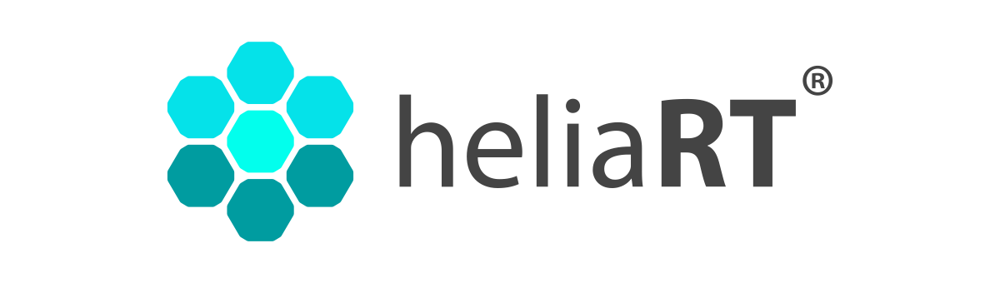

---
hide:
  - navigation
  - toc
---

<section class="landing-hero" markdown>

<div class="hero-copy" markdown>

{ .hero-logo width="260" }

<p class="hero-kicker"><span></span> HELIA AI runtime for Ambiq silicon</p>

# Run TensorFlow Lite for Microcontrollers faster on Apollo.

heliaRT is Ambiq's optimized TFLM runtime: the same `.tflite` models and MicroInterpreter API, backed by HELIA kernels tuned for Cortex-M and Apollo SPOT silicon.

<div class="hero-actions" markdown>
[Get started](getting-started/index.md){ .md-button .md-button--primary }
[Why heliaRT](why-helia-rt.md){ .md-button }
</div>

</div>

<div class="hero-panel" markdown>

<div class="panel-topline"><span>HELIA backend</span><span class="status-live">v1.13</span></div>

<div class="metric-grid">
  <div><strong>230+</strong><span>kernel variants</span></div>
  <div><strong>36</strong><span>operators</span></div>
  <div><strong>18</strong><span>CI build combos</span></div>
  <div><strong>3</strong><span>toolchains</span></div>
</div>

```cpp
// TFLM API, Ambiq-tuned implementation underneath
tflite::MicroMutableOpResolver<5> resolver;
resolver.AddConv2D();
resolver.AddFullyConnected();
resolver.AddSoftmax();

tflite::MicroInterpreter interpreter(
    model, resolver, arena, kArenaSize);
interpreter.AllocateTensors();
interpreter.Invoke();
```

</div>

</section>

<section class="logo-rail" aria-label="Supported ecosystems">
  <span>Zephyr</span>
  <span>Arm</span>
  <span>CMSIS-Pack</span>
  <span>neuralSPOT-X</span>
  <span>GCC</span>
  <span>ATfE</span>
  <span>Apollo510</span>
</section>

<section class="section-block section-block--intro" markdown>

<p class="section-eyebrow">What it is</p>

## A silicon-adjacent runtime layer in the HELIA AI stack

heliaRT sits between your TFLM application and Ambiq silicon. It keeps the upstream programming model intact while routing supported operations through HELIA kernel paths that are tuned for Apollo-class MCUs and Ambiq's SPOT® (Subthreshold Power Optimized Technology) platform.

<div class="takeaway-grid" markdown>

<a class="takeaway-card" href="why-helia-rt/">
  <span class="card-icon">01</span>
  <strong>Same model format</strong>
  <span>Use standard `.tflite` flatbuffers, `MicroInterpreter`, tensor arenas, and resolver registration. No retraining or application rewrite.</span>
</a>

<a class="takeaway-card" href="reference/operator-coverage/">
  <span class="card-icon">02</span>
  <strong>More fast paths</strong>
  <span>36 HELIA operators expand into 230+ kernel variants when int8, int16, float, and specialized code paths are counted separately.</span>
</a>

<a class="takeaway-card" href="reference/silicon-support/">
  <span class="card-icon">03</span>
  <strong>Apollo focused</strong>
  <span>Runs across Apollo3, Apollo4, Apollo510, and planned Atomiq targets, with Apollo510 benefiting most from Cortex-M55 + Helium.</span>
</a>

</div>

</section>

<section class="section-block" markdown>

<p class="section-eyebrow">How it works</p>

## Keep your TFLM surface. Swap the backend underneath.

<div class="workflow" markdown>

<div class="workflow-step"><span>1</span><strong>Build or bring a quantized model</strong><p>Use the same TensorFlow Lite for Microcontrollers model workflow you already have. Int8 and int16 variants map to separate optimized kernel paths where supported.</p></div>
<div class="workflow-step"><span>2</span><strong>Select HELIA at build time</strong><p>Choose Zephyr Kconfig, neuralSPOT-X deployment, source / CMake, or prebuilt static libraries. The application-facing runtime stays familiar.</p></div>
<div class="workflow-step"><span>3</span><strong>Ship on Apollo silicon</strong><p>Reference and CMSIS-NN remain available as fallbacks, while HELIA-covered ops take the Ambiq-tuned path for better latency and coverage.</p></div>

</div>

</section>

<section class="section-block" markdown>

<p class="section-eyebrow">Integration paths</p>

## Start from the environment you already use

<div class="platform-grid" markdown>

<a class="platform-card platform-card--primary" href="getting-started/zephyr/">
  <span class="logo-mark">Z</span><span class="platform-label">Zephyr RTOS</span><strong>Zephyr module</strong>
  <span>Drop heliaRT into a `west` workspace and toggle the HELIA backend through Kconfig. Use source builds or the prebuilt bundle.</span><em>Setup guide -></em>
</a>

<a class="platform-card" href="getting-started/neuralspot/">
  <span class="logo-mark">ns</span><span class="platform-label">Ambiq platform</span><strong>neuralSPOT-X</strong>
  <span>Profile, deploy, and benchmark `.tflite` models on Ambiq EVBs with `ns_autodeploy`. heliaRT ships as part of the flow.</span><em>Deployment path -></em>
</a>

<a class="platform-card" href="getting-started/cmsis-pack/">
  <span class="logo-mark">Arm</span><span class="platform-label">Arm ecosystem</span><strong>CMSIS-Pack</strong>
  <span>Planned package-manager workflow for Keil, IAR, and Open-CMSIS-Pack users. Track the roadmap while source builds are available.</span><em>Roadmap -></em>
</a>

<a class="platform-card" href="getting-started/source/">
  <span class="logo-mark">C</span><span class="platform-label">Custom builds</span><strong>Source / CMake</strong>
  <span>Full control over target, toolchain, and build type. Link `libtensorflow-microlite.a` directly into your project.</span><em>Build from source -></em>
</a>

</div>

</section>

<section class="section-block section-block--split" markdown>

<div markdown>

<p class="section-eyebrow">Toolchains</p>

## Three compiler paths, one tested release matrix

Every release is built across architecture, toolchain, and build-type combinations. **ATfE** is the recommended path for Cortex-M55 + MVE workloads, with GCC and Arm Compiler 6 available for teams that already standardize there.

[Read the toolchain guide](guides/toolchains.md){ .text-link }

</div>

<div class="toolchain-list" markdown>

<a href="guides/toolchains/" class="toolchain-row"><span class="tool-logo">GCC</span><strong>arm-none-eabi</strong><em>open source baseline</em></a>
<a href="guides/toolchains/" class="toolchain-row"><span class="tool-logo">Arm</span><strong>Arm Compiler 6</strong><em>commercial armclang path</em></a>
<a href="guides/toolchains/" class="toolchain-row toolchain-row--recommended"><span class="tool-logo">LLVM</span><strong>ATfE</strong><em>recommended for MVE</em></a>

</div>

</section>

<section class="section-block section-block--split" markdown>

<div markdown>

<p class="section-eyebrow">Coverage</p>

## HELIA expands the optimized surface beyond CMSIS-NN

CMSIS-NN covers the common convolutional core. HELIA adds optimized paths for activation, reduce, data movement, comparison, arithmetic, and other categories that often fall back to Reference C upstream.

[Open full operator matrix](reference/operator-coverage.md){ .text-link }

</div>

<div class="coverage-card" markdown>

<div class="coverage-row coverage-head"><span>Category</span><span>CMSIS-NN</span><span>HELIA</span></div>
<div class="coverage-row"><span>Conv / FC / Pooling</span><span class="yes">✓</span><span class="yes hot">✓</span></div>
<div class="coverage-row"><span>Activations</span><span class="no">-</span><span class="yes hot">✓</span></div>
<div class="coverage-row"><span>Reduce</span><span class="no">-</span><span class="yes hot">✓</span></div>
<div class="coverage-row"><span>Data movement</span><span class="no">-</span><span class="yes hot">✓</span></div>
<div class="coverage-foot"><strong>230+</strong> kernel variants across int8 / int16 / float paths</div>

</div>

</section>

<section class="section-block" markdown>

<p class="section-eyebrow">Quick start</p>

## Add heliaRT to Zephyr in three small steps

=== "west.yml"

    ```yaml
    manifest:
      projects:
        - name: helia-rt
          url: https://github.com/AmbiqAI/helia-rt
          revision: main
          path: modules/lib/helia-rt
    ```

=== "prj.conf"

    ```cfg
    CONFIG_HELIA_RT=y
    CONFIG_HELIA_RT_BACKEND_HELIA=y
    ```

=== "Build"

    ```bash
    west update
    west build -b apollo510_evb app
    west flash
    ```

<div class="resource-links" markdown>
[Full Zephyr guide](getting-started/zephyr.md){ .text-link }
[All getting started paths](getting-started/index.md){ .text-link }
[Upgrade from upstream TFLM](guides/upgrading-from-litert.md){ .text-link }
</div>

</section>

<section class="section-block final-links" markdown>

<a href="guides/"><strong>Guides</strong><span>Backend selection, SPEED vs SIZE, toolchains, memory placement, troubleshooting.</span></a>
<a href="examples/"><strong>Examples</strong><span>Working integration patterns for Zephyr, neuralSPOT-X, source builds, and CMake.</span></a>
<a href="reference/benchmarks/"><strong>Benchmarks</strong><span>Per-target measurements and comparisons across toolchains and build variants.</span></a>

</section>