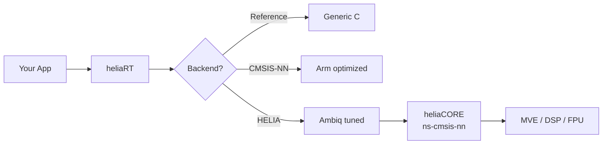

# Why heliaRT

heliaRT is a **drop-in replacement** for upstream LiteRT for Micro with Ambiq-tuned kernels. Same API, faster inference, purpose-built for Apollo silicon.

## The Problem

Upstream LiteRT ships two kernel backends:

- **Reference** — portable C, works everywhere, not fast.
- **CMSIS-NN** — Arm-optimized, good on Cortex-M, but only covers a subset of operators.

Many operators (activations, reduce, concat, reshape, split, dequantize, …) have **no** CMSIS-NN path — they silently fall back to Reference. On latency-sensitive workloads running on Apollo hardware, that's leaving performance on the table.

## The Solution

heliaRT adds a third backend — **HELIA** (heliaCORE / ns-cmsis-nn) — that fills the gaps:

!!! success "Drop-in upgrade"
    heliaRT uses the **exact same API** as upstream LiteRT for Micro — formerly TensorFlow Lite for Microcontrollers / TFLM — including `MicroInterpreter`, `Model`, `MicroMutableOpResolver`, tensor arenas, and `.tflite` models. Swap the dependency, rebuild, ship. No retraining, no re-quantization, no code changes.

## What HELIA Adds

| Category | HELIA-exclusive optimizations | Upstream has |
|---|---|---|
| **Activations** | `relu` · `relu6` · `logistic` · `tanh` · `leaky_relu` · `hard_swish` (+i16) | Reference only |
| **Reduce** | `reduce_mean` · `reduce_max` | Reference only |
| **Data movement** | `concatenation` · `reshape` · `split` · `split_v` · `pack` · `squeeze` · `strided_slice` · `fill` · `zeros_like` · `dequantize` | Reference only |
| **Arithmetic** | `sub` · comparisons | Reference only |
| **Compute** | `fully_connected` A16W16 path | Not available upstream |

[:octicons-arrow-right-24: Full operator matrix](reference/operator-coverage.md)

## Toolchain Advantage

heliaRT supports three toolchains. **ATfE** (Arm Toolchain for Embedded) is our recommended choice:

| Toolchain | License | Typical speedup vs GCC |
|---|---|---|
| GCC (arm-none-eabi) | Open source | Baseline |
| Arm Compiler 6 (armclang) | Commercial | ~5–15 % |
| **ATfE** (LLVM-Embedded) | **Open source** | **~10–20 %** |

ATfE is fully open-source, actively maintained by Arm, and produces measurably faster code on Cortex-M55 MVE workloads.

[:octicons-arrow-right-24: Toolchain guide](guides/toolchains.md)

## Two Build Variants

Every release artifact ships in two flavours:

| Variant | Compiler flags | Best for |
|---|---|---|
| **SPEED** | `-O2` / `-Ofast` | Latency-critical (audio, always-on) |
| **SIZE** | `-Os` / `-Oz` | Flash-constrained / battery-first |

[:octicons-arrow-right-24: SPEED vs SIZE guide](guides/speed-vs-size.md)

## Silicon Coverage

| SoC | Core | DSP | MVE / Helium |
|---|---|---|---|
| Apollo3 / Apollo3p | Cortex-M4F | ✓ | — |
| Apollo4 / Apollo4p | Cortex-M4F | ✓ | — |
| Apollo510 | Cortex-M55 | ✓ | ✓ |
| Atomiq | _(planned)_ | | |

[:octicons-arrow-right-24: Silicon support matrix](reference/silicon-support.md)

## Next Steps

- [Getting Started](getting-started/index.md) — pick your integration path
- [Upgrading from upstream LiteRT](guides/upgrading-from-litert.md) — step-by-step swap guide
- [Operator Coverage](reference/operator-coverage.md) — the full REF / CMSIS-NN / HELIA matrix
