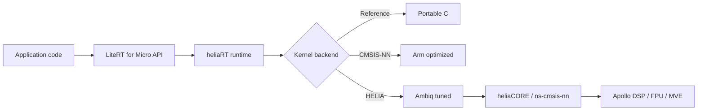

---
hide:
    - title
    - toc
---

#

<section class="why-hero" markdown>

## Keep the LiteRT workflow. Move more work onto Ambiq-optimized paths.

heliaRT is Ambiq's silicon-adjacent runtime layer for LiteRT for Micro. It keeps the same `.tflite` models, `MicroInterpreter` lifecycle, resolver pattern, and tensor arena model while routing supported operations through HELIA kernels tuned for Apollo silicon.

[Start integrating](getting-started/index.md){ .md-button .md-button--primary }
[View operator coverage](reference/operator-coverage.md){ .md-button }

</section>

<strong>Drop-in</strong>same API surface

<strong>36</strong>HELIA operators

<strong>230+</strong>kernel variants

<strong>3</strong>toolchain paths

## The problem: portable kernels are not enough for production edge AI

Upstream LiteRT for Micro gives embedded teams a reliable programming model, but its default backend mix leaves many workloads running more Reference C than expected. Reference kernels are portable and easy to reason about, yet they are not tuned for the memory hierarchy, vector extensions, DSP instructions, or deployment constraints of a specific MCU family.

CMSIS-NN improves the most common neural-network primitives on Arm Cortex-M devices, especially convolutional workloads. But CMSIS-NN does not cover the full operator surface used by real models. Activations, reductions, tensor reshaping, slicing, packing, comparison, and other support operations can still fall back to Reference. On small models, those support operations may be a meaningful share of total inference time.

### Reference
Portable C kernels that work across targets. They are the safety net, not the performance strategy for latency-sensitive Apollo deployments.

### CMSIS-NN
Open Arm-optimized kernels for common neural-network operations. Strong baseline coverage for Cortex-M, but not a complete answer for every operator category.

### HELIA
Ambiq-tuned kernel paths that expand the optimized surface area and make Apollo-class silicon the first-class target, not just another supported board.

## The solution: a third backend that fits the HELIA AI stack

heliaRT adds HELIA as a third backend alongside Reference and CMSIS-NN. The runtime keeps the upstream API intact while the build selects the best available kernel implementation for each operator. When HELIA coverage exists, supported operations take the Ambiq-tuned path. When it does not, CMSIS-NN and Reference remain available as fallbacks.

!!! success "Drop-in upgrade"
    heliaRT uses the **same API** as upstream LiteRT for Micro, formerly TensorFlow Lite for Microcontrollers / TFLM. Keep `MicroInterpreter`, `Model`, `MicroMutableOpResolver`, tensor arenas, and `.tflite` models. Swap the dependency, rebuild, and keep moving without retraining or rewriting application code.

## What HELIA adds

HELIA is most useful when a model is already functionally correct and the next problem is production readiness: lower latency, predictable build outputs, and fewer unexpected Reference fallbacks. It broadens the optimized path beyond the convolutional core and includes separate optimization paths for int8, int16, float, and specialized cases where those variants matter.

### Broader operator coverage
HELIA covers categories that often sit outside CMSIS-NN, including activation, reduce, data movement, comparison, arithmetic, and selected compute paths. The result is less time spent in generic Reference code.

### Variant-aware optimization
Kernel counts are not just operator names. Int8 and int16 paths can have different implementations, tradeoffs, and vectorization strategies. heliaRT tracks those paths as separate kernel variants.

### Ambiq platform alignment
The runtime is designed around Apollo-class deployments and the HELIA AI stack, including Ambiq's SPOT® platform and silicon-adjacent tooling for profiling, packaging, and integration.

| Category | HELIA-focused optimizations | Typical upstream fallback |
|---|---|---|
| **Activations** | `relu` · `relu6` · `logistic` · `tanh` · `leaky_relu` · `hard_swish` (+i16) | Reference |
| **Reduce** | `reduce_mean` · `reduce_max` | Reference |
| **Data movement** | `concatenation` · `reshape` · `split` · `split_v` · `pack` · `squeeze` · `strided_slice` · `fill` · `zeros_like` · `dequantize` | Reference |
| **Arithmetic** | `sub` · comparison paths | Reference |
| **Compute** | `fully_connected` A16W16 path | Not available upstream |

[:octicons-arrow-right-24: Full operator matrix](reference/operator-coverage.md){ .text-link }

## Built for the way Ambiq projects ship

Performance is only one part of making an embedded inference stack useful. Teams also need repeatable builds, predictable artifacts, and integration paths that match their existing product environment. heliaRT gives those concerns the same weight as kernel selection.

### Toolchain choice
Every release is built across architecture, toolchain, and build-type combinations. **ATfE** is the recommended path for Cortex-M55 + MVE workloads, while GCC and Arm Compiler 6 remain available for teams with existing compiler standards.

| Toolchain | Best fit |
|---|---|
| GCC | open-source baseline |
| Arm Compiler 6 | commercial armclang path |
| ATfE | recommended for MVE |

[Read the toolchain guide](guides/toolchains.md){ .text-link }

### Build variants
Release artifacts ship in **SPEED** and **SIZE** variants so teams can choose the right tradeoff for each product. Audio and always-on workloads may prioritize latency; flash-constrained products may prefer smaller binaries.

| Variant | Best for |
|---|---|
| SPEED | latency-critical inference |
| SIZE | flash-constrained deployments |

[Compare SPEED vs SIZE](guides/speed-vs-size.md){ .text-link }

## Where it fits

heliaRT is not a new model format or a new application framework. It is the runtime layer that lets existing LiteRT for Micro applications take better advantage of Ambiq silicon. Use neuralSPOT-X when you want fast model evaluation and profiling, Zephyr when you are integrating into an RTOS-based product, CMSIS-Pack as that ecosystem path matures, or source builds when you need direct control over target and toolchain details.

| Path | Why it matters |
|---|---|
| **Zephyr** | Module-based integration, backend selection through Kconfig, source or prebuilt bundles |
| **neuralSPOT-X** | Fast model profiling, deployment, and benchmarking on Ambiq EVBs |
| **CMSIS-Pack** | Planned package-manager path for Arm ecosystem projects |
| **Source / CMake** | Full control over target, toolchain, and static library linkage |

## Next steps

<a href="getting-started/" markdown>
### Pick an integration path
Start with Zephyr, neuralSPOT-X, CMSIS-Pack, or source builds depending on how your project is structured.
</a>

<a href="guides/upgrading-from-litert/" markdown>
### Upgrade from upstream LiteRT
Follow the migration guide for swapping the runtime dependency while preserving the application-facing API.
</a>

<a href="reference/operator-coverage/" markdown>
### Check operator coverage
Review which operators use Reference, CMSIS-NN, and HELIA paths before planning benchmark work.
</a>

